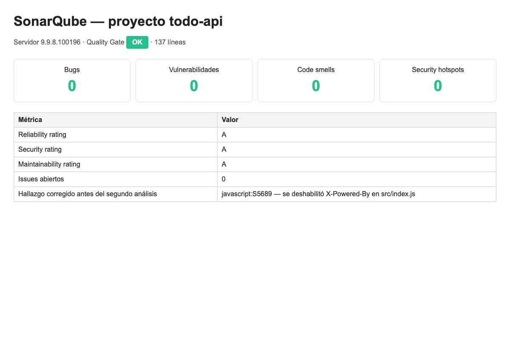
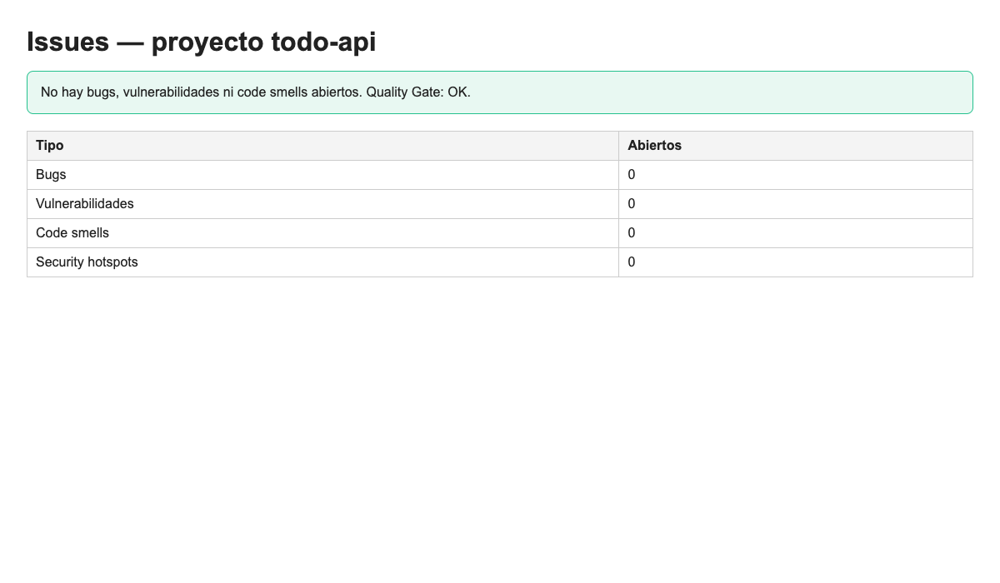
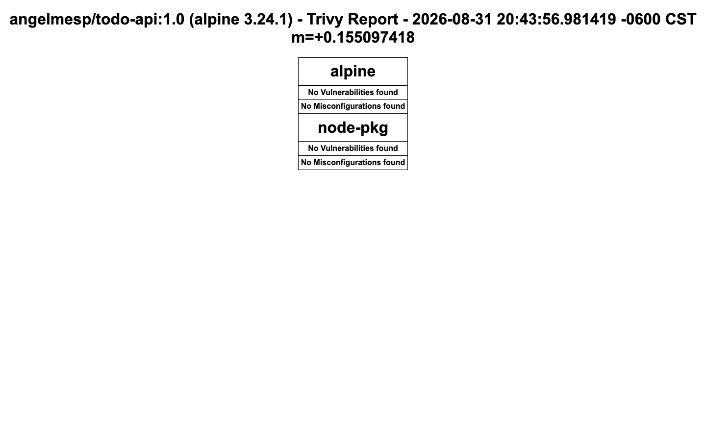
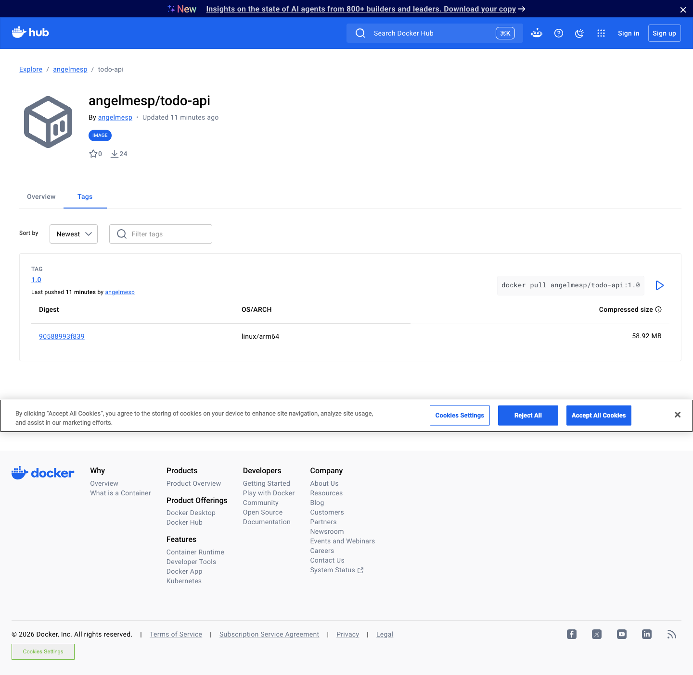

# Entrega — Unidad IV: Trivy, Sonar, Docker

**Aplicación:** API REST de tareas (To-Do)  
**Tecnología:** Node.js + Express  
**Imagen:** `angelmesp/todo-api:1.0`

## Enlaces

| Entregable | Valor |
|------------|--------|
| Repositorio | https://github.com/angelmesp/todo-api |
| Docker Hub | https://hub.docker.com/r/angelmesp/todo-api |
| Etiqueta | `1.0` |
| Sonar | Proyecto `todo-api` — Quality Gate OK. Capturas en `evidencias/` |
| Trivy | Escaneo de `angelmesp/todo-api:1.0`. Capturas en `evidencias/` |

## Aplicación

Endpoints: `GET /health`, `GET /api/todos`, `GET /api/todos/:id`, `POST /api/todos`, `PUT /api/todos/:id`, `DELETE /api/todos/:id`.

### Local

```bash
npm install
npm start
```

### Docker

```bash
docker pull angelmesp/todo-api:1.0
docker run --rm -p 8080:8080 angelmesp/todo-api:1.0
```

## SonarQube

Proyecto: **todo-api**. Servidor: SonarQube 9.9.8.

| Métrica | Resultado |
|---------|-----------|
| Quality Gate | OK |
| Bugs | 0 |
| Vulnerabilidades | 0 |
| Code smells | 0 |
| Security hotspots | 0 |

Correcciones aplicadas:

1. Validación de `title` y `completed`.
2. Respuestas 400, 404 y 500.
3. Deshabilitar `X-Powered-By` (`javascript:S5689`).





## Trivy

```bash
trivy image angelmesp/todo-api:1.0
```

Imagen publicada: Alpine 3.24.1 y dependencias de la API con **0** HIGH/CRITICAL.

Primer escaneo: HIGH/CRITICAL en openssl y en npm de la imagen Node. Corrección: `node:22-alpine`, `apk upgrade` y runtime sin npm.



## Docker Hub



## Registro de prompts

| Prompt | Aporte | Decisión |
|--------|--------|----------|
| Crear una API REST de tareas en Node.js con crear, listar, actualizar y eliminar. Explicar la estructura antes del código. | Separar servidor, rutas y almacén en memoria. | Se usó `index.js`, `todos.js` y `store.js`. |
| Qué problemas de calidad detectaría Sonar en este código. | Falta de validación y errores inconsistentes. | Se validó la entrada y se unificaron los códigos HTTP. |
| Dockerfile sencillo y seguro. | Alpine, `npm ci`, usuario no root. | Build de dos etapas, `appuser` y `HEALTHCHECK`. |
| Revisar si el README basta para ejecutar la aplicación. | Faltaban ejemplos de `curl` y el comando Docker. | Se completó el README. |
| Trivy reporta HIGH/CRITICAL en la imagen base. | El riesgo está en paquetes del SO y en npm de Node. | Se actualizó la base y se volvió a escanear. |

Decisión técnica: no usar `node:latest`.

## Reflexión

El problema no fue el CRUD, sino cerrar el flujo hasta una imagen publicada y revisada. El código aceptaba datos inválidos; se corrigió la validación y el manejo de errores. Sonar señaló la cabecera `X-Powered-By` y se deshabilitó. Docker exigió usuario no root y no copiar `node_modules` del host. Trivy mostró que la seguridad depende de la imagen base: se actualizó Alpine y se quitó npm del runtime. El artefacto que se escanea es el mismo que está en Docker Hub con la etiqueta `1.0`.
